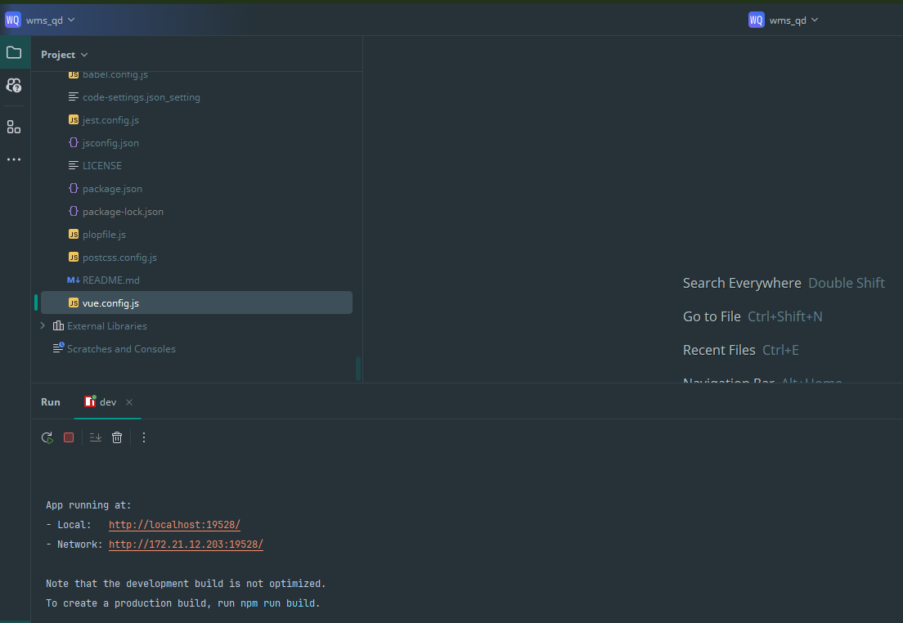
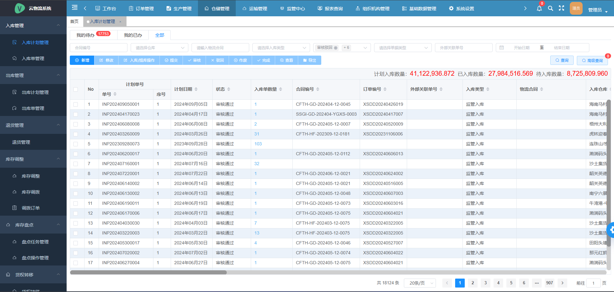

# open_commodity_scm_erp_wms
这是一个开源的大宗商品供应链管理 (Supply Chain Management)与仓储管理 (WMS) 系统，旨在为大宗商品贸易与管理提供高效、透明、可扩展的解决方案。
本项目为wms前端模块。

## 项目特性
- **供应链管理（SCM）**：覆盖采购、物流、库存、订单处理全流程。
- **仓储管理（WMS）**
  - **入库与出库流程管控**：自动对接采购与发货指令，实现准确的入库检验和快速拣货出库。
  - **库存优化与盘点**：支持库位管理、批次追踪、库存预警和自动补货建议，并可定期执行盘点任务。
  - **多仓协同与跨区域管理**：可管理多个仓库，支持集中调拨与差异化策略，提升整体库存周转率。
- **数据分析与可视化**
  - **可定制仪表盘与报表**：针对各业务模块提供灵活的数据可视化工具，支持图表、报表、自定义查询。
  - **业务预警与KPI监控**：基于关键业务指标（如库存周转率、供应商交付周期、订单履约率）自动生成提醒或预警。

- **扩展性与集成支持**
  - **模块化设计**：各功能模块（SCM、ERP、WMS）可独立部署或组合使用，具备清晰的模块边界和可扩展性接口。
  - **第三方系统对接**：预留标准化API接口，可与财务软件、物流平台、电子商务网站以及BI工具进行无缝集成。
  - **插件与定制开发**：支持根据行业特点与业务规模进行二次开发与插件扩展，灵活适应不同应用场景。

- **安全性与合规**
  - **用户权限与角色管理**：基于角色与权限分级管理，确保数据访问与操作的安全性与合规性。
  - **审计与日志记录**：全程记录关键操作日志，有助于问题追溯和合规审计。

## 联系我们
若有任何疑问、建议或问题，请在本项目的 [Issues](https://github.com/zxhbloomer/open_commodity_scm_erp_wms/issues) 区提出，或通过以下方式与我们联系：
- 邮箱：zxhbloomer@aliyun.com
- 微信二维码（扫码联系）：

  

## 如何运行（前端 Vue 项目）

### 环境准备
请确保本地已安装以下环境与工具：
- [Node.js](https://nodejs.org/) (建议使用 LTS 版本，如 Node.js 16+)
- [npm](https://www.npmjs.com/) 或 [Yarn](https://yarnpkg.com/) 包管理工具

### 获取源码
从 GitHub 仓库克隆本项目源码：
```bash
git clone https://github.com/username/open_commodity_scm_erp_wms.git

# 使用 npm
npm install
# 运行
npm run dev
```

### 示例截图

1. **启动开发服务器后的终端输出**  
   在终端中运行 `npm run dev` 后，您将会看到类似以下的终端输出，显示开发服务器启动成功以及访问地址：  
   

2. **浏览器访问本地服务**  
   打开浏览器，访问 `http://localhost:8080`（默认端口），您将会看到 Vue 前端应用的首页面：  
   

3. **模块与菜单示例**  
   项目加载完成后，您可以查看各个管理模块（如库存、订单、财务）的界面布局以及交互菜单：  
   


